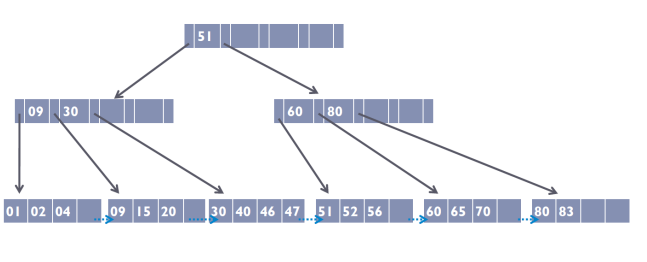

# Árvore B+

Esta é uma aplicação em C que utiliza a estrutura Árvore B+ para armazenar os registros de Clientes em arquivos binários. 



## Integrantes do grupo

O trabalho foi feito para a disciplina de Estrutura de Dados II, ministrada pelo professor Dr. Ubiratam de Paula, pelos seguintes alunos:
- Beatriz Cardoso de Souza Silva
- Leonardo Iglesias Ferreira
- João Mario de Lima Ferreira
- Rafael Rocha Aranzate

O código foi feito com base no material fornecido pelo professor.

## Funcionalidades

Nesta aplicação, é possível:
- Criar estruturas de Clientes
```c
Cliente *ze = cliente(10, "Ze");
```
- Armazenar dados dos clientes em uma estrutura de arquivos Árvore B+
```c
inserir(ze, f_metadados, f_indice, f_dados);
```
- Buscar informações dos clientes de acordo com sua chave
```c
imprime_resultado_busca(10, f_metadados, f_indice, f_dados);
```
```
Posição do nó no arquivo de índice: 0
Posição do nó no arquivo de dados: 0
Posição que o cliente está ou deveria no vetor S do nó de dados: 0
Encontramos? 1
```

## Estruturas utilizadas

O projeto possui quatro estruturas principais:
- ```Cliente```: Estrutura que armazena código e nome do cliente.
```c
typedef struct Cliente {
    int codCliente;        // código do cliente
    char nome[100];        // nome do cliente
} Cliente;
```
- ```Metadados```: Estrutura que armazena a posição do nó raíz e uma flag que diz se a raíz é folha ou não.
```c
typedef struct Metadados {
    int pont_raiz;           // ponteiro para a raiz da árvore
    int flag_raiz_folha;     // flag se a raíz é folha
} Metadados;
```
- ```No```: Nós internos da Árvore B+, com d=2. Cada nó comporta 4 chaves e 5 ponteiros para posições dos filhos nos arquivos.
```c
typedef struct No{
    int m;                  // Número de chaves armazenadas no nó
    int flag_aponta_folha;  // Flag booleano que diz se a página aponta para a folha
    int ppai;               // Ponteiro no arquivo para o nó pai
    int s[4];               // Vetor de chaves s0, s1, s2, s3
    int p[5];               // Vetor de ponteiros no arquivo para nós p0, p1, p2, p3, p4
} No;
```
- ```NoDados```: Nós folha da Árvore B+. Cada nó comporta 4 Clientes.
```c
typedef struct NoDados{
    int m;                  // Número de chaves armazenadas no nó
    int ppai;               // Ponteiro no arquivo para o nó pai
    int pprox;              // Ponteiro para a próxima página (Não foi utilizada)
    Cliente *s[4];          // Vetor de clientes s0, s1, s2, s3
} NoDados;
```

## Organização do arquivo main.c

O arquivo main.c está organizado em 9 blocos:
1. INFO: estrutura com informações sobre a busca de uma chave na árvore;
2. FUNÇÕES PARA ABERTURA DE ARQUIVOS: possui as funções utilizadas para manipulação de arquivos;
3. FUNÇÕES PARA CRIAÇÃO DOS ARQUIVOS DA ÁRVORE B+: cria os arquivos metadados.dat, dados.dat, indice.dat;
4. FUNÇÕES QUE LEEM E IMPRIMEM CONTEÚDO DOS ARQUIVOS: possui funções de leitura e impressão dos arquivos
5. BUSCA: funções de busca e impressão;
6. FUNÇÕES AUXILIARES DA INSERÇÃO: funções auxiliares das funções de inserção
7. INSERIR: funções de inserção
8. TESTES: função para testar a inserção de um conjunto de clientes na árvore B+
9. MAIN: função principal

## Execução da main.c

Ao executar o arquivo main.c, 3 arquivos binários serão criados: 
- ```metadados.dat```: arquivo binário que armazena os metadados da aplicação
- ```dados.dat```: arquivo binário com informações dos nós-folha (clientes) criados.
- ```indice.dat```: arquivo binário com informações dos nós-internos criados.

Além disso, uma função teste() será executada, inserindo as seguintes chaves na árvore:
```
{30, 40, 10, 20, 11, 19, 18, 17, 50, 12, 60, 31, 32, 33, 61, 13, 14, 45, 61, 63, 64, 65, 100}
```

A árvore criada na função de teste terá este formato:


No fim da execução, o conteúdo dos arquivos ```dados.dat```, ```indice.dat``` e ```metadados.dat``` é exibido.

## Como executar

Para executar, obtenha um compilador de arquivos C (como o GCC) e faça o dowloand dos arquivos deste repositório. Na pasta onde estiverem os arquivos, insira o comando no terminal para compilar:
```bash
gcc -o prog main.c
```

E para executar, insira no terminal:
```bash
./prog
```
